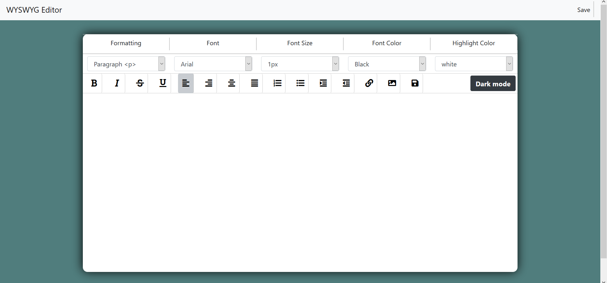
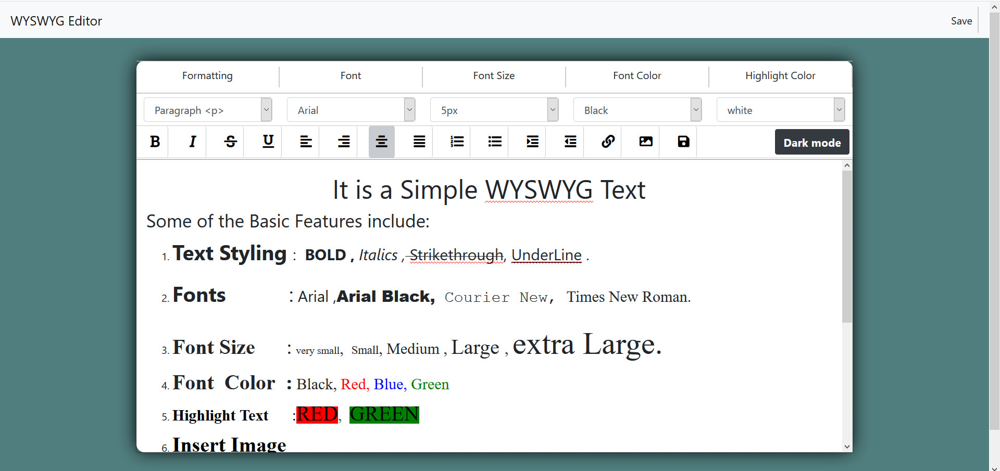
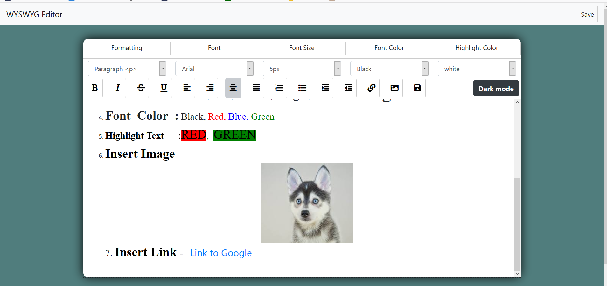
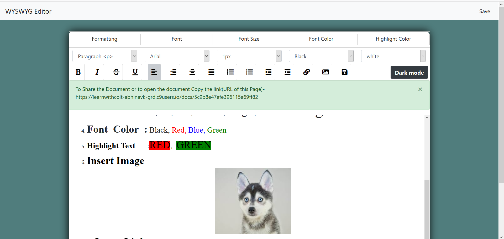

<h1>Team Name- Its_One</h1> 
 
Members- 
Member 1: Abhinav kumar (https://github.com/abhinav-grd) 
Member 2: Rahul Agarwal (https://github.com/RahulRexx) 

 
 
The Text editor App is hosted on - <a href="https://online-text-editor.herokuapp.com/">Online-text-editor</a>
 
 
 
<h2>Online WYSWYG (What You See Is What You Get) Text Editor</h2>
This web app can be used to create and edit documents using features like bullets, bold, italic, font_color etc.

<h2>How it works ?</h2>
A DIV tag is used as a textpad by making it editable by setting its Contenteditable property to true. This exposes the execCommand function which is used to change   properties of selected text and to insert html elements like image and links  when the corresponding buttons are pressed

<h2>Screenshots</h2>

This is First page of the App with empty text area
 
 
 

Various features of the text editor are demostrated in this screenshots like font size, font color, bullet points etc.
 
 
 

Image Upload and Embedded are also supported.
 
 
 

The saved document can then be accesed by going to the assigned webpage. just after saving the document the website redirects to the priview page of the saved document.
